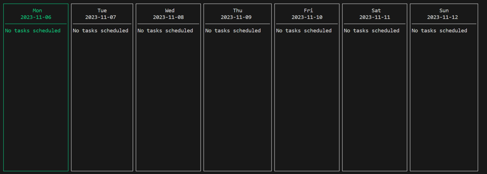

A simple calender app written in Rust, using Ratatui.

The application is modeled on my understanding of the MVC architecture. 

To use, create an empty JSON file in the top-most directory of the application.

Navigate with left and right arrow keys. Scroll with up and down arrow keys.
Press 1-7 to add tasks, and SHIFT+1-7 to clear tasks. 

Will add cleaner README later, along with a few more features. 

